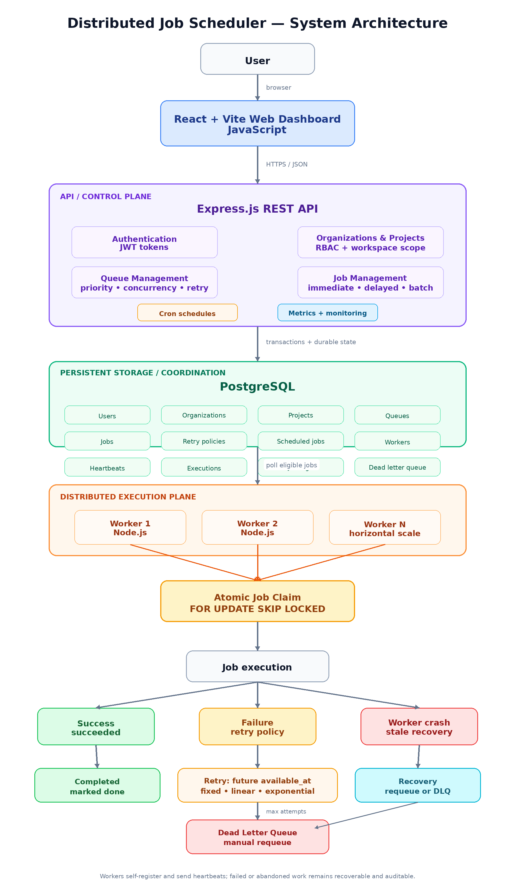

# Evaluator Demo Guide

A short structured demo can communicate the architecture more clearly than browsing features randomly.

## 1. Start With Architecture

Show:



Explain:

- frontend = management UI,
- Express = control-plane API,
- PostgreSQL = state + transactional coordination,
- workers = execution plane,
- cron materializer = recurring schedule producer.

## 2. Authenticate

- register/login,
- show organization/project selection.

## 3. Create or Open a Queue

Show:

- priority,
- concurrency limit,
- retry policy,
- pause/resume.

## 4. Create Immediate Job

Create a job and show:

```text
pending → running → succeeded
```

Open details and show execution/log history.

## 5. Demonstrate Multiple Workers

Run two worker processes.

Explain that they self-register and safely compete for jobs.

Mention:

```sql
FOR UPDATE SKIP LOCKED
```

## 6. Queue Concurrency

Explain that queue concurrency is enforced globally across workers.

## 7. Delayed / Scheduled Job

Create a delayed or future job and show that it cannot be claimed before `available_at`.

## 8. Recurring Schedule

Create a cron schedule.

Show:

- cron,
- timezone,
- next run,
- activation state.

Explain materialization.

## 9. Retry and DLQ

Execute a deliberately failing/unsupported job type if your demo handler supports that behavior.

Show retry attempts and eventual DLQ entry.

## 10. Requeue

Requeue the dead job and explain that the failure entry is removed and the job becomes pending again.

## 11. Workers Page

Show:

- online/stale/offline,
- CPU,
- memory,
- uptime,
- active jobs,
- recent executions,
- heartbeats.

## 12. Finish With Reliability

Summarize the production-inspired features:

- atomic claims,
- multiple workers,
- queue concurrency,
- retries,
- DLQ,
- heartbeats,
- stale worker recovery,
- graceful shutdown,
- execution history,
- recurring scheduling,
- RBAC.
